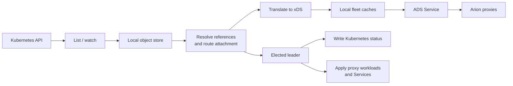

# Kubernetes controller

[Project overview](../../README.md) · [Helm installation](../../charts/arion-ctl/README.md) ·
[Architecture](../../docs/architecture.md)

This app watches Kubernetes Gateway API resources, translates their configuration
into xDS, and serves it to Arion proxies. It can also provision the proxy
workloads and services associated with each Gateway.

A **GatewayClass** chooses the controller implementation. A **Gateway** defines
the traffic entry points belonging to that class. Route resources attach routing
rules to those entry points. For this controller, the default class is `arion`
and its controller identity is `arion.io/gateway-controller`.

## Install and understand the flow

Follow the [chart README](../../charts/arion-ctl/README.md) for CRDs, images,
Helm installation, and verification. The Helm chart is the installation entry
point; this README describes the controller's behavior and Arion-specific options.



Every controller replica runs the watch/resolve/translate/publish path. Each
Gateway has an isolated fleet. The elected leader performs status and provisioning
writes; it is not the only replica serving xDS.

## Supported resources and features

The table describes implementation and local test coverage, not a certification
of complete Gateway API conformance. Unit translation tests do not establish that
a particular image works in a cluster. Use conformance reports for the exact
controller/proxy versions you deploy.

| Area | Implemented behavior | Limits, prerequisites, and evidence |
| --- | --- | --- |
| GatewayClass / Gateway | Claims the configured controller identity; resolves listeners and attachments | Per-Gateway fleets; [resolver tests](test/reconcile/resolver_test.exs), [status tests](test/status/conditions_test.exs) |
| HTTPRoute | Host/path/header/query/method matching, precedence, weighted backends, header changes, redirects, rewrites, timeouts, retries | Supported translation subset; see [HTTP translation](test/reconcile/translate_http_test.exs), [filter](test/reconcile/http_filters_test.exs), and [precedence](test/reconcile/precedence_test.exs) tests |
| GRPCRoute | Method/service matching and HTTP/2 backend configuration | [gRPC tests](test/reconcile/grpc_test.exs); verify the intended proxy's HTTP/2 behavior |
| HTTPS | Kubernetes Secret certificate references translated into TLS and xDS Secrets | First usable certificate per listener; invalid or unresolvable references reported; [HTTPS](test/reconcile/https_test.exs) and [certificate](test/reconcile/certificate_test.exs) tests |
| TCPRoute | TCP listener and backend forwarding | Required route CRD/version must be installed; [L4 tests](test/reconcile/l4_test.exs) |
| TLSRoute | SNI-based TLS passthrough, or termination (listener mode Terminate) followed by TCP forwarding | Terminate uses the listener's first usable certificate; Passthrough, Terminate, and HTTPS listeners can share a port; [L4](test/reconcile/l4_test.exs) and [shared-port](test/reconcile/shared_port_test.exs) tests |
| ReferenceGrant | Cross-namespace backend and certificate reference checks | Attachment and namespace policy still apply; [backend-resolution](test/reconcile/backend_resolution_test.exs) and HTTPS tests |
| InferencePool | Inference backend translation, endpoint-picker external processing, and an EDS cluster of the pool's ready Pods that routes to the picked endpoint (`x-gateway-destination-endpoint`), otherwise round robin | Requires Inference Extension CRDs and a compatible endpoint picker/proxy; [inference tests](test/reconcile/inference_test.exs) |
| UDPRoute / UDP listeners | Resource kind is watched | UDP listeners are unsupported and are not translated; [IR tests](test/ir/ir_test.exs) |
| ArionGatewayParameters | Proxy image, replicas, service type, metadata, resources, self-managed mode | [Provisioning tests](test/deployer/deployer_test.exs); fields listed below |

Services, EndpointSlices, Pods, Secrets, Namespaces, and Deployments are watched
to resolve references, evaluate namespace selection, and report data-plane
readiness/addresses. Service backends become EDS clusters of the Service's ready
EndpointSlice addresses; InferencePool endpoints come from Pods. The presence of a
watch or a schema definition alone does not mean the corresponding traffic feature
is supported.

The watcher currently requests Gateway API `v1` resources and InferencePool
`inference.networking.k8s.io/v1`. A kind unavailable at that version is treated
as empty and checked again every 30 seconds. This does not convert older served
versions automatically. Consult the [chart prerequisites](../../charts/arion-ctl/README.md#prerequisites)
when installing stream routes or inference features.

Shared listener ports are resolved by protocol and hostname. Conflicts are
reported in status rather than arbitrarily choosing a listener. Use the
shared-port tests linked above for the exact supported combinations.

## Provisioning and ArionGatewayParameters

By default, each Gateway causes the leader to apply a Deployment, Service,
ServiceAccount, and bootstrap ConfigMap in the Gateway's namespace. They carry
Gateway owner references. Deleting the Gateway lets Kubernetes garbage-collect
those objects.

For `default/edge`, the objects are named `gateway-default-edge`. Names longer
than 63 characters, or changed by sanitizing, end in a hash; see
[`Ir.Gateway.object_name/2`](lib/arion_k8s_controller/ir/ir.ex). The fleet is
`gateway/default/edge` ([`Ir.Gateway.fleet/2`](lib/arion_k8s_controller/ir/ir.ex))
and is never shortened.

With the chart installed and its default GatewayClass present, this
[complete example](../../docs/examples/kubernetes/parameters.yaml) provisions
two proxies behind a ClusterIP Service:

```yaml
apiVersion: arion.io/v1alpha1
kind: ArionGatewayParameters
metadata:
  name: edge-settings
  namespace: default
spec:
  replicas: 2
  serviceType: ClusterIP
  resources:
    requests: {cpu: 100m, memory: 128Mi}
    limits: {memory: 512Mi}
---
apiVersion: gateway.networking.k8s.io/v1
kind: Gateway
metadata:
  name: edge
  namespace: default
spec:
  gatewayClassName: arion
  infrastructure:
    parametersRef:
      group: arion.io
      kind: ArionGatewayParameters
      name: edge-settings
  listeners:
    - name: http
      protocol: HTTP
      port: 80
```

From the repository root:

```sh
kubectl apply -f docs/examples/kubernetes/parameters.yaml
kubectl -n default get gateway edge -o yaml
kubectl -n default get deployment,service,serviceaccount,configmap gateway-default-edge
```

The example defines provisioning and a listener; attach a standard route to
`default/edge` using the [upstream HTTP routing guide](https://gateway-api.sigs.k8s.io/guides/user-guides/http-routing/)
to send application traffic to a backend.

### Parameter fields and precedence

| Field | Default / meaning |
| --- | --- |
| `image` | Controller's configured Arion image; override with a compatible versioned image |
| `replicas` | `1` data-plane replica |
| `serviceType` | `LoadBalancer`; also accepts `ClusterIP` or `NodePort` |
| `resources` | Proxy container resource requests/limits |
| `labels` | Added to generated labels; merged with Gateway infrastructure labels |
| `annotations` | Added to generated object metadata; merged with infrastructure annotations |
| `selfManaged` | `false`; `true` skips provisioning |

A Gateway references parameters through `spec.infrastructure.parametersRef`.
A GatewayClass can instead reference a shared parameter object through
`spec.parametersRef` with `group: arion.io`, `kind: ArionGatewayParameters`,
`name`, and an explicit `namespace`.

The resolved Gateway parameter object takes precedence over the GatewayClass
object. The controller selects one object's specification; it does not merge
the two specifications field by field. Missing fields in the selected object
use defaults. An invalid Gateway infrastructure reference (wrong group/kind or
a missing parameter object in the Gateway namespace) produces
`Accepted=False` with reason `InvalidParameters`; that Gateway is neither
translated nor provisioned. An invalid GatewayClass reference (wrong group/kind,
no `namespace`, or a missing object) makes the class `Accepted=False` with
reason `InvalidParameters`, and its Gateways report the same and are neither
translated nor provisioned. Parameter labels/annotations take precedence over Gateway
infrastructure metadata when keys overlap.

### Self-managed proxies

Set `selfManaged: true` in the selected parameter object to manage proxy
workloads yourself. The controller continues to translate and serve the Gateway's
xDS resources while skipping provisioning writes.

Your proxy needs:

- An ADS bootstrap targeting the controller service, normally
  `arion-ctl-controller-ads.arion-system.svc.cluster.local:50051` for the
  documented Helm release and namespace.
- HTTP/2 for the xDS connection.
- `node.cluster` matching the Gateway fleet, such as `gateway/default/edge`.
- Network reachability to Kubernetes Service backends and any required Secrets.

`selfManaged` does not migrate or delete previously generated objects. Plan
ownership of those objects when switching an existing Gateway.

Gateway `Programmed` currently follows readiness of the expected generated-name
Deployment, and addresses come from the corresponding Service. Independently
named self-managed workloads may therefore serve traffic while that status
remains pending or lacks addresses. Inspect proxy connectivity and real traffic.

## Replicas, readiness, and status

The chart enables BEAM clustering with a shared cookie. A headless Service
discovers peers; one leader writes status/provisions workloads. Every replica
lists Kubernetes objects and publishes its own deterministic xDS view. Replicas
do not share a standalone snapshot directory.

ADS starts only after initial synchronization and publication. The chart's startup
probe allows five minutes, and readiness checks the ADS port. RBAC, API
connectivity, or failed lists can prevent startup readiness; inspect controller
logs before changing probe thresholds.

Use these checks, adjusting names/namespaces for your release:

```sh
kubectl -n arion-system rollout status deployment/arion-ctl-controller
kubectl get gatewayclass arion -o yaml
kubectl -n default get gateway edge -o yaml
kubectl -n arion-system logs deployment/arion-ctl-controller --tail=100
```

Check condition `observedGeneration` against the resource generation.
`Accepted` concerns controller/listener/route acceptance; `ResolvedRefs`
describes referenced objects and permissions; `Programmed` follows the
data-plane readiness rule above. None replaces a request through the proxy.

## Runtime configuration and local development

Helm sets these values for an installation. Outside the chart, the runtime reads:

| Variable | Purpose |
| --- | --- |
| `GATEWAY_CONTROLLER_NAME` | Controller identity; default `arion.io/gateway-controller` |
| `KUBECONFIG` | Local Kubernetes credentials; in-cluster mode uses the ServiceAccount |
| `GATEWAY_CONTROL_PLANE_PORT` | ADS port; default 50051 |
| `GATEWAY_LEADER_ELECTION` | Enable clustering/leader election when exactly `true` |
| `GATEWAY_ARION_IMAGE` | Default provisioned proxy image |
| `GATEWAY_ADS_SERVICE`, `GATEWAY_ADS_NAMESPACE` | Address placed in proxy bootstraps |
| `GATEWAY_CLUSTER_SELECTOR`, `GATEWAY_CLUSTER_NAMESPACE`, `GATEWAY_CLUSTER_POD_BASENAME` | Peer discovery settings |
| `GATEWAY_RESYNC_INTERVAL_MS` | Periodic re-list of every watched kind and full reconciliation; default 300000 ms |

The runtime watches all namespaces; it does not expose an environment variable
for namespace restriction. `KUBERNETES_SERVICE_HOST` selects in-cluster mode.
The chart configures node names, the shared cookie, and distribution ports.
Its peer selector targets the release's labeled headless-Service Endpoints; keep
that selector consistent with Service labels when configuring clustering manually.

This application performs Kubernetes writes when started with usable credentials.
For local work, use a disposable cluster and an intended kubeconfig. Run
`mix deps.get`, `mix format --check-formatted`, and `mix test` from this app
directory. See [development](../../docs/development.md) for image builds and
the existing conformance runner.

## Learn Gateway API

- [Getting started](https://gateway-api.sigs.k8s.io/guides/getting-started/introduction/):
  concepts, CRDs, and standard guides.
- [HTTP routing](https://gateway-api.sigs.k8s.io/guides/user-guides/http-routing/):
  route attachment and backend selection.
- [API reference](https://gateway-api.sigs.k8s.io/reference/api-spec/):
  resource fields; choose the version matching your installed CRDs.
- [Inference Extension](https://gateway-api-inference-extension.sigs.k8s.io/):
  InferencePool and endpoint-picker concepts.

When finished with the provisioning example, remove just its objects:

```sh
kubectl delete -f docs/examples/kubernetes/parameters.yaml
```

The controller uses Arion identities; legacy Orion controller/CRD identities are
not supported.
