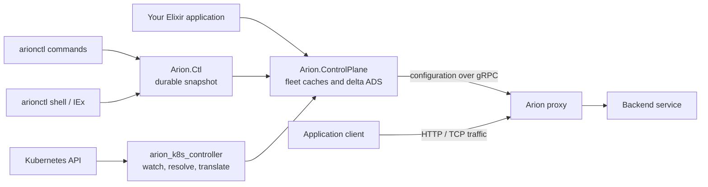
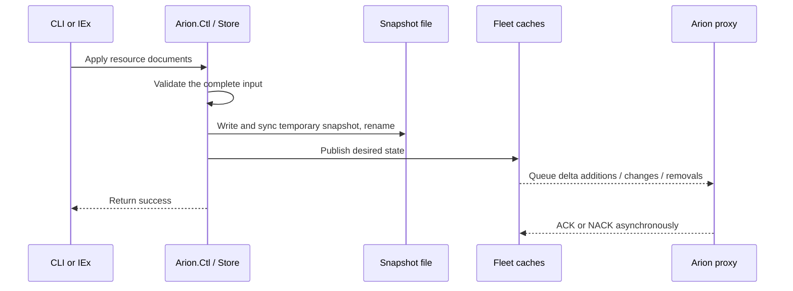

# Architecture

[Documentation index](README.md) · [Deployment options](deployment-options.md)

## Data plane and Control plane split

An Arion proxy receives application traffic, chooses an upstream backend, and
forwards the request. A control plane supplies the configuration that drives
those choices. Once the proxy has configuration, it never has to interact with
the control plane to process requests.

Multiple apps and a shared xDS library:

These branches represent alternative owners of configuration. For a standalone
service, use `Arion.Ctl` so changes enter its durable store. For the Kubernetes
controller, change Kubernetes resources so reconciliation can reproduce them.
For an embedded library, your application supplies and restores the resources.

## The resource model

| Resource | Meaning | Discovery name |
| --- | --- | --- |
| Listener | An incoming address/port and its filter chains | LDS: Listener Discovery Service |
| RouteConfiguration | Virtual hosts and rules that select a response or backend | RDS: Route Discovery Service |
| Cluster | An upstream service, its discovery method, and connection settings | CDS: Cluster Discovery Service |
| ClusterLoadAssignment | The addresses and ports belonging to a cluster | EDS: Endpoint Discovery Service |
| Secret | A certificate/key or TLS validation context | SDS: Secret Discovery Service |

For an HTTP request, a listener uses an HTTP connection manager to select a
virtual host and route. The route names a cluster, which supplies backend
addresses. A listener can reference a Secret to terminate TLS.

Routes and endpoints may be included inside a listener or cluster. They may
also be separate resources referenced by name. Separate resources allow endpoint
or routing changes without replacing the containing listener. Publishing an
unreferenced resource does not make a proxy use it.

The [configuration reference](configuration-reference.md) explains how to define
these resources in configuration files and with Elixir helpers.

## Bootstrap and dynamic configuration

The **bootstrap** is a local file read by the proxy at startup. In the examples it
provides:

- A node ID identifying the proxy, and `node.cluster` selecting its fleet.
- A static cluster named `xds` pointing to the control-plane address.
- HTTP/2 settings needed for the gRPC connection.
- An ADS configuration telling the proxy to use that connection.

The application listener and backend are then supplied dynamically. Editing
the bootstrap does not publish an xDS change; restart the proxy to use an edited
bootstrap. Apply changes to a standalone resource configuration file with
`arionctl apply` to publish them.

**ADS** aggregates resource discovery over a gRPC stream. This library implements
delta ADS: it sends changed resource versions and explicit removals rather than
requiring each update to transmit every resource. A synchronous cache replacement
is not a transaction across all resource types at the proxy.

## Fleets and isolation

A fleet is a set of resources, selected by `node.cluster` in the proxy's
first discovery request. The default is `arion`. Proxies in the same fleet see
that fleet's resources; different fleets can reuse resource names.

In standalone resource definitions, `metadata.fleet` selects the fleet. In the
library, it is the leading `Service` argument. The Kubernetes controller creates
a fleet for each Gateway, named `gateway/<namespace>/<name>`.

The fleet is independent of the proxy's node ID. Fleets organize
configuration; they do not authenticate clients. Expose ADS only on networks
where the connecting proxies are trusted.

## Three paths into xDS

### Embedded

Your application creates protobuf resources, often using the helper modules,
and publishes them through `Arion.ControlPlane.Service`. The library starts a
fleet process lazily and stores its resources in memory. One control-plane
supervision tree runs per BEAM node (an Erlang VM process).

`push` and `drop` enqueue changes asynchronously. `replace` synchronously
replaces one fleet's complete resource set and queues additions, changes, and
removals. Your application owns recovery. Start with `serve?: false`, restore
desired state, then call `Arion.ControlPlane.serve/1` to accept proxies.

### Standalone

The CLI and remote IEx shell call the same `Arion.Ctl` API:

Apply merges resources by fleet, kind, and name. It replaces each supplied
resource's full specification, while preserving resources absent from the input.
Delete explicitly removes identities. Startup restores the snapshot before ADS
accepts connections. Each standalone process needs its own state directory;
the snapshot store has no multi-writer or replicated-storage protocol.

### Kubernetes

Each controller replica lists and watches Kubernetes objects, resolves
references and route attachment, translates the resulting graph into xDS, and
publishes its local fleet caches. Periodic resync and process recovery recompute
the desired state from Kubernetes.

Every replica serves xDS. With clustering enabled, one elected leader writes
Kubernetes status and provisions proxy objects. Each replica waits for its
initial lists and first publish before binding ADS. Controller replicas do not
replicate standalone snapshots or xDS stream state; they independently derive
configuration from Kubernetes.

## What does success mean?

An **ACK** means a proxy accepted a particular resource version. A **NACK** means
it rejected an update, with an associated error. A pending response has not yet
been acknowledged. Status is per connected stream; reconnects can change the
stream identifiers shown in output.

A successful apply means persisted and queued. An ACK still does not prove that
a backend is reachable or that a particular request matches the intended route.
Use status together with a request through the proxy and its logs.

The versioned protobuf definitions are a supported subset. Validation catches
unknown fields and encoding errors; semantic requirements and compatibility with
the proxy are separate checks. See [validation and compatibility](configuration-reference.md#validation-and-compatibility).
